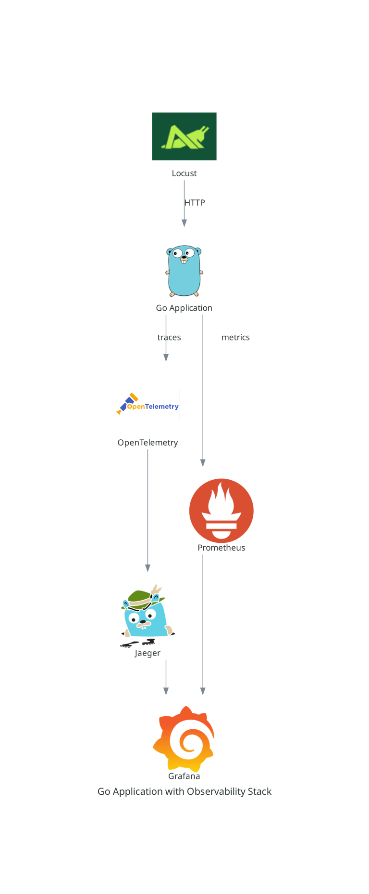

# Go Application with Observability Stack

This project demonstrates a Go application integrated with a comprehensive observability stack, including distributed tracing, metrics collection, and load testing.

## Components

- **Go Application**: A simple HTTP service with Swagger documentation
- **OpenTelemetry**: For distributed tracing
- **Jaeger**: For trace visualization
- **Prometheus**: For metrics collection
- **Grafana**: For metrics and trace visualization
- **Locust**: For load testing

## Prerequisites

- Docker and Docker Compose
- Go 1.16 or later (for local development)

## Getting Started

1. Clone this repository:
   ```
   git clone git@github.com:CoryBarney/grafana-otel-go-example.git
   cd grafana-otel-go-example
   ```

2. Build and start the services:
   ```
   docker-compose up -d
   ```

3. Access the services:
   - Go Application: http://localhost:8080
   - Swagger UI: http://localhost:8080/swagger/index.html
   - Grafana: http://localhost:3000
   - Jaeger UI: http://localhost:16686
   - Prometheus: http://localhost:9090
   - Locust: http://localhost:8089

## Configuration Files

- `docker-compose.yml`: Defines all services and their configurations
- `Dockerfile`: Builds the Go application container
- `otel-collector-config.yaml`: Configures the OpenTelemetry Collector
- `prometheus.yml`: Configures Prometheus scrape targets
- `grafana-datasources.yaml`: Configures Grafana data sources
- `grafana-dashboards.yaml`: Configures Grafana dashboard provisioning
- `dashboards/go-app-dashboard.json`: Grafana dashboard for the application
- `locustfile.py`: Defines the load testing scenarios

## Development

To work on the Go application locally:


1. Change to application directory:
    ```
    cd app
    ```

2. Install dependencies:
   ```
   go mod download
   ```

3. Run the application:
   ```
   go run main.go
   ```

4. To update Swagger documentation:
   ```
   swag init
   ```

5. To run tests:
   ```
   go test -v
   ```

  Note: The tests use a no-op tracer to handle tracing in the test environment. This allows the tests to run without a full OpenTelemetry setup.

## Load Testing

Locust is configured to start automatically and run a load test against the application. To modify the load test:

1. Edit `locustfile.py`
2. Restart the Locust service:
   ```
   docker-compose restart locust
   ```

Note: The Locust service is configured with an increased open file limit (65536) to support high-volume load testing. If you're running this setup on a system with lower limits, you may need to adjust the `ulimits` configuration in the `docker-compose.yml` file.

## Observability

- **Metrics**: View in Grafana or query directly in Prometheus
- **Traces**: View in Jaeger UI or in Grafana (if configured)
- **Logs**: View docker logs:
  ```
  docker-compose logs -f
  ```

## Customization

- To add new metrics, update the Go application and Prometheus configuration
- To modify tracing, update the OpenTelemetry configuration in the Go application
- To add or modify Grafana dashboards, edit the JSON files in the `dashboards` directory

## Troubleshooting

- If services fail to start, check the logs:
  ```
  docker-compose logs <service-name>
  ```
- Ensure all required ports are available on your host machine
- Verify that all configuration files are present and correctly formatted

### Common Issues

1. **Connection refused errors**: Ensure that the service names in your Docker Compose file match the hostnames used in your configurations.

2. **Locust file limit warning**: If you see a warning about the system open file limit being too low, check that the `ulimits` configuration in the Docker Compose file is applied correctly.

3. **No data in Grafana**: Verify that Prometheus and Jaeger are successfully scraping data from your application. Check the Prometheus targets page and Jaeger search page to confirm data is being collected.

4. **Permission Denied on Mounted Files**: Vertify Context and Setting of Selinux or AppArmour (`sudo setenforce 0`)

## Performance Considerations

- The current setup is designed for local development and testing. For production use, you would need to adjust configurations for security and scalability.
- Monitor the resource usage of your containers, especially during load testing, to ensure your host system can handle the load.
- Consider adjusting the retention periods and sample rates in Prometheus and Jaeger for longer-term data storage in a production environment.

## Architecture

Below is a high-level overview of the system architecture:



This diagram illustrates the flow of data between the different components of the system:

1. Locust sends HTTP requests to the Go Application for load testing.
2. The Go Application processes requests and generates observability data.
3. Metrics are sent to Prometheus for storage and querying.
4. Traces are sent to the OpenTelemetry Collector, which forwards them to Jaeger.
5. Grafana collects data from both Prometheus and Jaeger for visualization and monitoring.

## Continuous Integration

This project uses GitHub Actions for continuous integration. On every push to the `main` branch and for every pull request, the following steps are automatically run:

1. Swagger documentation is generated
2. Go tests are executed
3. `go vet` is run to check for potential issues
4. `staticcheck` is used for additional static analysis

You can see the detailed configuration in the `.github/workflows/go-tests.yml` file.

To run these checks locally:

```bash
cd app
swag init
go test -v ./...
go vet ./...
staticcheck ./...  # You need to install staticcheck first: go install honnef.co/go/tools/cmd/staticcheck@latest
```

Note: Make sure you have `swag` installed locally to generate Swagger docs: `go install github.com/swaggo/swag/cmd/swag@latest`


## Contributing

Please read CONTRIBUTING.md for details on our code of conduct and the process for submitting pull requests.

## License

This project is licensed under the MIT License - see the LICENSE.md file for details.

## Acknowledgments

- OpenTelemetry community for providing excellent documentation and tools
- Grafana Labs for their powerful visualization platform
- Jaeger team for their distributed tracing system
- Locust team for their user-friendly load testing tool

## Further Reading

- [OpenTelemetry Documentation](https://opentelemetry.io/docs/)
- [Jaeger Documentation](https://www.jaegertracing.io/docs/)
- [Prometheus Documentation](https://prometheus.io/docs/introduction/overview/)
- [Grafana Documentation](https://grafana.com/docs/)
- [Locust Documentation](https://docs.locust.io/en/stable/)

For any additional questions or support, please open an issue in the project repository.
